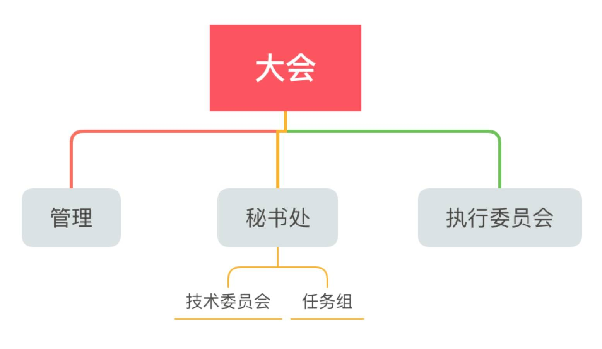
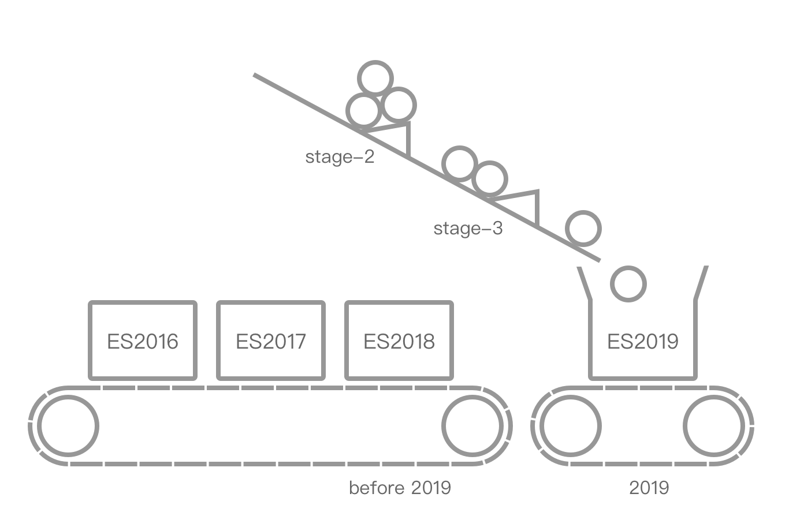
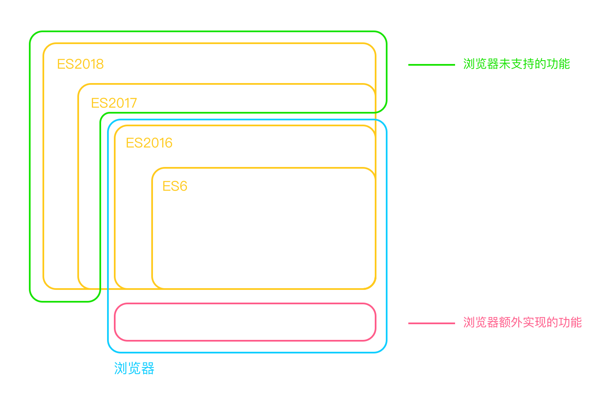
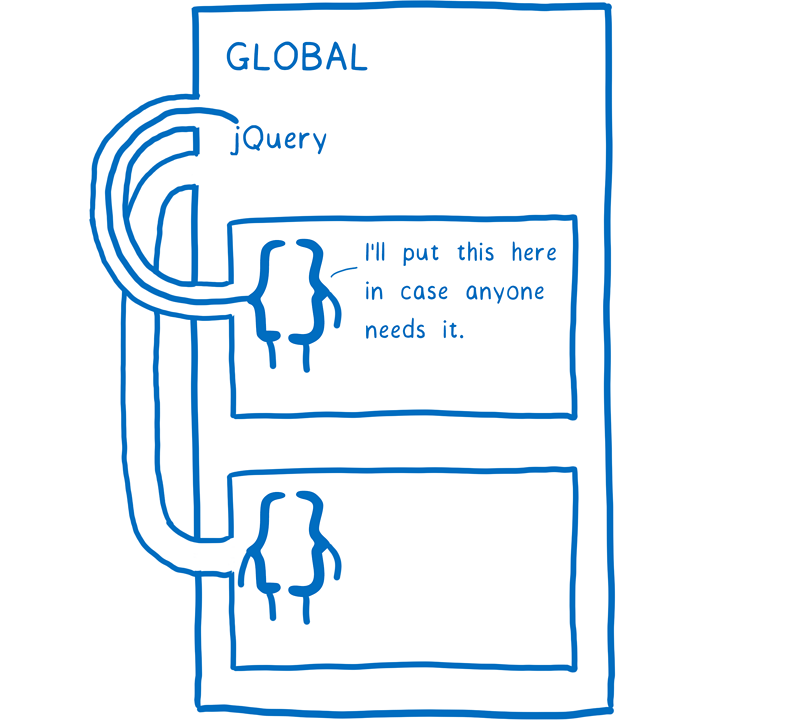
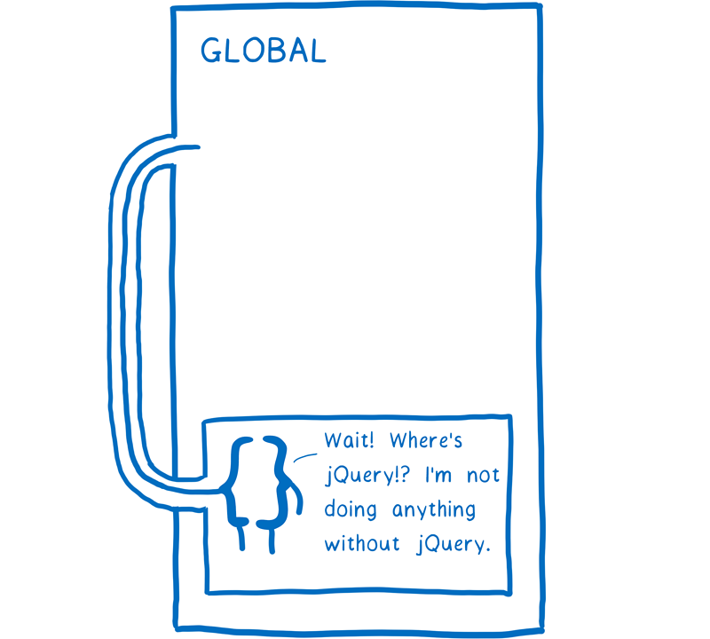
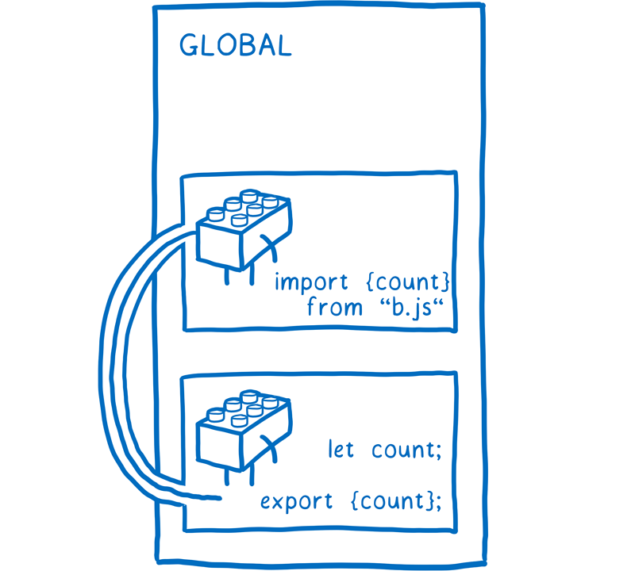
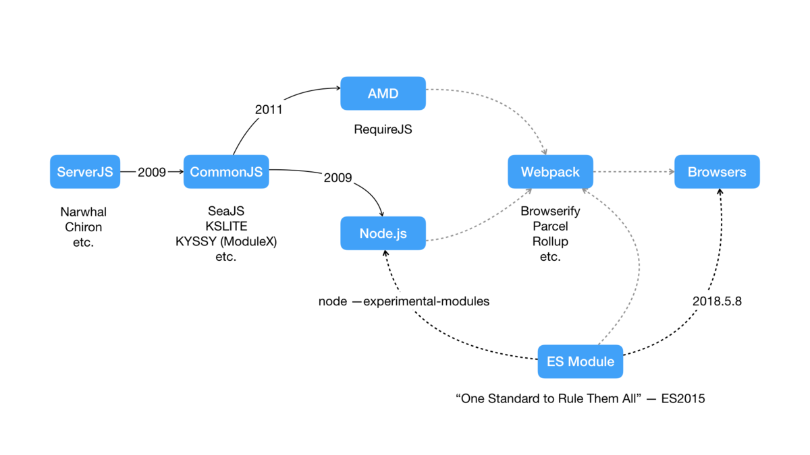
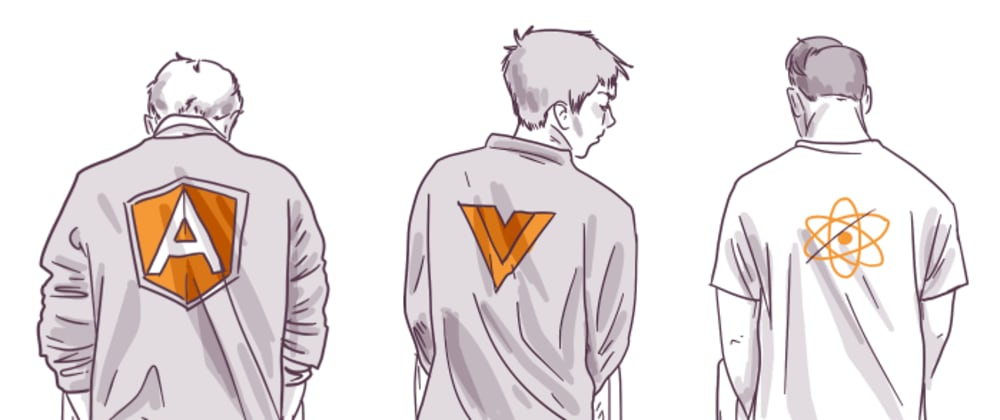

## 前端UI框架发展

<small>Created by [王晓博](https://shawb-wong.now.sh/) @2019.12.31</small>

---


--


###### [Acid 2 screenshots](http://www.howtocreate.co.uk/acid/)

--


[网络的演变](http://www.evolutionoftheweb.com/) {.fragment .fade-right .fs24}

---

::: block
目录 
{style=background:teal;width:400px;}
::: 
-----
*   JS语法标准的制定
*   模块化发展
*   框架演进

---


::: block
ECMAScript 
{style=background:green;width:400px;}
::: 
ECMAScript 是由 ECMA国际 标准组织以 ECMA-262 和 ECMA-402 规范的形式进行标准化的脚本程序设计语言。

--

::: block
TC39
{style=background:green;width:400px;}
:::
Technical Committee, 在ECMA中制定ECMA-262标准的组织

-----

::: block
TG
{style=background:green;width:400px;}
:::
Task Groups, [ECMA ORG](http://www.ecma-international.org/memento/TCs&TGs.htm)

-----

::: block
ECMA General Assembly
{style=background:green;width:600px;}
:::
[ECMA委员会](https://www.ecma-international.org/memento/ga.htm)

--



--

::: block
W3C
{style=background:green;width:600px;}
:::
Word Wide Web Consortium

-----

::: block
[WHATWG](https://github.com/w3c/dom)
{style=background:green;width:600px;}
:::
Web Hypertext Application Technology Working Group, origin named W3C DOM Working Group

-----

::: block
这两个组织的纷纷扰扰{.fragment .fade-right}
{style=background:red;width:600px;}
:::

[HTML5标准背后的那场闹剧](https://www.techug.com/post/html5-w3c-and-whatwg.html){.fragment .fade-right}

[W3C推行DOM4.1陷困境，只因巨头齐反对](https://t.cj.sina.com.cn/articles/view/6095981310/16b594afe00100aqzp){.fragment .fade-right}

---

<figure class="flexbox">
    
    
</figure>

--


--

<!-- .slide: style="font-size: 30px;" -->

| Edition| Official|Date Published|feature|
|--------|:-------:|----:|----:|
|ES10|ES2019|[June 2019](https://github.com/tc39/proposals/blob/master/finished-proposals.md)|Array.prototype.flat,flatMap|
|ES9|ES2018|June 2018|for await..of|
|ES8|ES2017|June 2017|async/await Object.entries|
|ES7|ES2016|June 2016|includes、template string|
|ES6|ES2015|June 2015|<span style="color: #2A89FF;">Module</span>、Promise、Proxy|
|ES5.1|ES5.1|June 2011|序列化、数据处理、类关键字|
|ES5|ES5|December 2009|严格模式,json功能更完整|
|ES4|ES4|<span style="color: #2A89FF;">Abandoned</span>|-|
|ES3|ES3|December 1999|[ES3规范](https://yanhaijing.com/es5/ECMAScript%E8%A7%84%E8%8C%83-%E7%AC%AC%E4%B8%89%E7%89%88_%E4%B8%AD%E6%96%87%E7%89%88.pdf)|
|ES2|ES2|June 1998|[遵循ISO/IEC16262国际标准](https://www-archive.mozilla.org/js/language/E262-2.pdf)|
|ES1|ES1|June 1997|[第一版](https://www-archive.mozilla.org/js/language/E262.pdf)|

--

<!-- .slide: data-transition="slide" data-background="#1c231f" data-background-transition="zoom" -->

::: block
ES4黑历史
{style=background:teal;width:600px;}
:::
- [ECMAScript 6 会重蹈 ECMAScript 4 的覆辙吗？](https://www.zhihu.com/question/24715618/answer/34813745)
- [从 ES4 历史做的一些不友好的揣测](https://segmentfault.com/a/1190000008550491)
- [The Only Thing We Have To Fear Is Premature Standardization](https://yuiblog.com/blog/2008/08/14/premature-standardization/)

--


---

#### 为什么要有模块化

规模化带来的问题：全局变量、依赖管理{.fragment .fade-in}

```js
// IIFE结合Closures
;(function($) {     
    var myPrivateFunction = function() {
    };
    var init = function() {
        myPrivateFunction();
    };
    $(init);    
})(jQuery);

window.$ = function somethingElse() {
  // ...
};

// 命名空间结合沙盒模式
YUI.add('dom', function(Y) {
  Y.DOM = { ... }
});

YUI().use('dom', function(Y) {
  Y.DOM.doSomeThing();
  // use some methods DOM attach to Y
});

```

###### 早期解决：jQuery、YUI、Google Closure Library

--

<figure class="flexbox">
    
    
    
</figure>

--



--

::: block
CommonJS
{style=background:green;width:600px;}
:::
- 由Mozilla工程师Kevin Dangoor在09年创建的ServerJS发展而来，属于民间规范，最终产出[Modules/1.1.1](http://wiki.commonjs.org/wiki/Modules/1.1.1)和[Modules/Async/A](http://wiki.commonjs.org/wiki/Modules/Async/A) {.fs28}

- 社区成员Substack开发Browserify，支持浏览器使用require, 把非CJS输入转换成CJS{.fs28}
- Node包管理器NPM作者Issac Schlueter已[不遵循CommonJS规范](https://github.com/nodejs/node-v0.x-archive/issues/5132) {.fs28}

--

###### CommonJS不适用前端场景

浏览器发起网络请求下载文件，阻塞浏览器渲染，不像服务端直接从硬盘或内存中读取 {style="font-size: 24px;color: #2A89FF;}

::: block
CMD
{style=background:green;width:600px;}
:::
- 依赖就近，与CJS和Node的模块规范兼容，SeaJS为代表 {.fs24}
- 不足：依赖SPM打包，加载逻辑较繁重{.fs24}
```js
define(function(require, exports, module) {
  var $ = require('jquery');
  exports.doSomething = ...;
  module.exports = ...;
})
```

::: block
AMD
{style=background:green;width:600px;}
:::
- 依赖前置，并行加载多个模块，requireJS、esl为代表（angular1){.fs24}
- 不足：模块定义方式的语义不顺畅, 提高了开发成本{.fs24}
```js
require(["module", "../file"], function(module, file) {
    // use module, file content
});
```

--

"如何真正做到前后端共享代码?"

webpack, rollup{.fragment .fade-right}

--

#### ES Module

::: block
[优势](http://calculist.org/blog/2012/06/29/static-module-resolution/)
{style=background:green;width:400px;}
:::
- require加载并export模块是Object，import是动态引用{.fs28}
- import是Declaration，require()是statement{.fs28}
- 静态import确保被编译成变量引用，可进行JIT编译优化{.fs28}
- 静态export使变量检测更准确{.fs28}
- 更完备的循环依赖处理{.fs28}
- 兼容未来可能的标准（宏、类型系统等）{.fs28}

::: block
不足
{style=background:green;width:400px;}
:::
- ES Module采用静态分析，无法dynamic import{.fs28}
- npm社区有大量兼容工作(Dual-Module Packages){.fs28}

--

#### 书写方式

::: block
浏览器端
{style=background:green;width:600px;}
:::

```html
<script type="module" src="./bar.js"></script>
<script type="module">
import './foo.mjs';
</script>
<script nomodule src="./app.bundle.js"></script>
```

::: block
Node
{style=background:green;width:600px;}
:::

```js
import "./foo"
// or
import "./foo.mjs"
```

---


--



--

<!-- .slide: style="font-size: 28px;" -->

| |     MPA    |          SPA           |||
| | jQuery | React | Vue | Angular |
|--- | ------- | :-----: | :-----: | :-----: |
| birth | August 2006 | May 2013 | February 2014 | October 2010 |
| 优势 | 初学者友好，简单场景 |  FP | 初学者友好 | TS |
| ^^ | 社区活跃，插件较多|社区活跃，插件较多||测试框架优秀|
| ^^ | 旧浏览器, SEO场景 |具备同构与跨平台能力 |||
| ^^ | 含网络请求与动画处理 | 用户交互、跳转响应迅速，富应用首选 |||
| 劣势 | 移动端不理想 | 不支持SEO |||
| ^^ | 不支持同构和多端 | 基础框架代码2MB以上 |||
|  ^^ | 架构不利于功能迭代 | 知识体系大，前端技能要求高 |||
| 生态 | jQuery UI | Antd | ElementUI | Material UI |
| ^^ | Bootstrap | Gatsby | Vant UI | Onsen UI |
| |

--

::: block
Template Engine
{style=background:green;width:600px;}
:::
输入模板字符串 + 数据，得到渲染过的字符串。适用于后端渲染jade, pug, yaml等模版。{.fs28 .tl}

常用Mustache、handlebars、ETPL、sodajs。{.fs28  .tl}

-----

###### [有哪些好用的前端模板引擎？](https://www.zhihu.com/question/32524504) {.tl}

--

::: block
Virtual DOM
{style=background:green;width:600px;}
:::
研发效率和用户体验之间的妥协产物，为后续的同构和多端框架提供基础{.fs28}

#### Pros:{.tl}
* 牺牲部分性能的前提下，增加了可维护性{.fs28}
* 数据改变时用最小的代价来更新 DOM，提高效率{.fs28}
* 抽象渲染过程，以便支持跨平台和同构{.fs28}

#### Cons:{.tl}
- 时间上，首次渲染大量DOM时，比innerHTML插入慢{.fs28}
- 空间上，Virtual DOM需要在内存中的维护一份DOM的copy{.fs28}
- 频繁更新单一节点，性能表现将不如原生API{.fs28}

---

#### 未来


* [2019年JS语言使用调查](https://2019.stateofjs.com/) {.fs28}

--

#### 跨端框架及跨框架组件{.tl}

* [跨端框架 Hippy 对外开源](https://v.qq.com/x/page/i3038urj2mt.html)
* [systemjs](https://github.com/systemjs/systemjs)、[JSPM](https://jspm.io/)、[@pika/web](https://pika-web-example-simple.glitch.me/)、[wired-elements](https://github.com/wiredjs/wired-elements)

#### 云开发{.tl}
* [stackblitz](https://stackblitz.com/)、[codesandbox](https://codesandbox.io/)、[vscode online](https://areknawo.com/vs-code-goes-online/)
* [未来的软件开发方式](https://mp.weixin.qq.com/s?__biz=MjM5Mjg4NDMwMA==&mid=2652977219&idx=1&sn=6dba1b1249894d063476da0702750204)
* [基于浏览器的实时构建探索之路](https://developer.aliyun.com/article/740300)
* [前端工程的下一站：IDE](https://developer.aliyun.com/live/1853)
* [VS Code goes online](https://areknawo.com/vs-code-goes-online/)

---

::: block
资料 
{style=background:teal;width:400px;}
::: 

-----

1. [在框架设计中寻求平衡](https://juejin.im/post/5d45be46f265da03cf7a70d7)
1. [前端模块的历史沿革](https://www.cyj.me/programming/2018/05/22/about-module-i/)
1. [A Brief History of Javascript](https://auth0.com/blog/a-brief-history-of-javascript/)
1. [ES modules: A cartoon deep-dive](https://hacks.mozilla.org/2018/03/es-modules-a-cartoon-deep-dive/)
1. [Front End Handbook](https://frontendmasters.com/books/front-end-handbook/2019/)
1. [Choose Between Traditional Web Apps and Single Page Apps (SPAs)](https://docs.microsoft.com/en-us/dotnet/architecture/modern-web-apps-azure/choose-between-traditional-web-and-single-page-apps)
1. [JavaScript Modules: A Beginner’s Guide](https://www.freecodecamp.org/news/javascript-modules-a-beginner-s-guide-783f7d7a5fcc/)
